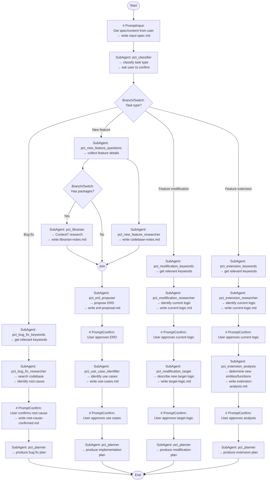

## Workflow Execution Guide

Follow the Mermaid flowchart above. This workflow handles **all task types** with appropriate routing.

### Execution Methods by Node Type
- **Rectangle nodes (SubAgent: ...)**: Run the specified sub-agent prompt file from `.claude/agents/`.
- **Prompt nodes**: Execute the prompt text below and write the required output file.
- **Diamond nodes (Branch/Switch: ...)**: Branch based on classification result.
- **Join node**: Continue only after required upstream artifacts exist.

### Branch Rules

#### Branch: Task type?
Based on classification from `pct_classifier`:
- **Bug fix** → bug fix flow
- **Feature modification (A → B)** → modification flow
- **Feature extension (add C)** → extension flow
- **New feature** → new feature flow

#### Branch: Has packages?
Read `input-spec.md`:
- If it mentions packages/libraries → run `pct_librarian`
- Otherwise skip Librarian and continue

## Prompt Node Details

### prompt_input(# PromptInput...)
Get the spec/content from the user:
- What is the task/request?
- Paste the spec or describe the requirement

Write `input-spec.md` with the raw user input.

### prompt_bug_fix_confirm(# PromptConfirm...)
Share root cause findings from `pct_bug_fix_researcher` and ask user to confirm before proceeding to planning.

### prompt_erd_confirm(# PromptConfirm...)
Share ERD proposal from `pct_erd_proposer` and ask user to approve before identifying use cases.

### prompt_use_case_confirm(# PromptConfirm...)
Share use cases from `pct_use_case_identifier` and ask user to approve before planning.

### prompt_current_logic_confirm(# PromptConfirm...)
Share current logic description and ask user to approve before describing target logic.

### prompt_target_logic_confirm(# PromptConfirm...)
Share target logic description and ask user to approve before planning.

### prompt_extension_current_confirm(# PromptConfirm...)
Share current logic and ask user to approve before extension analysis.

### prompt_extension_analysis_confirm(# PromptConfirm...)
Share extension analysis and ask user to approve before planning.

## Expected Artifacts (files)

**Common**:
- `input-spec.md` — User's raw input

**Bug fix flow**:
- `classification-result.md` — Task type classification
- `bug-fix-keywords.md` — Relevant keywords for searching
- `root-cause-analysis.md` — Root cause findings
- `root-cause-confirmed.md` — User confirmation
- `implementation-plan.md` — Final plan

**New feature flow**:
- `classification-result.md`
- `new-feature-details.md` — Collected feature details
- `librarian-notes.md` — Package research (optional)
- `codebase-notes.md` — Codebase research
- `erd-proposal.md` — Proposed ERD
- `erd-confirmed.md` — User approval
- `use-cases.md` — Identified use cases
- `use-cases-confirmed.md` — User approval
- `implementation-plan.md` — Final plan

**Feature modification flow**:
- `classification-result.md`
- `modification-keywords.md` — Relevant keywords
- `current-logic.md` — Current logic description
- `current-logic-confirmed.md` — User approval
- `target-logic.md` — Target logic description
- `target-logic-confirmed.md` — User approval
- `implementation-plan.md` — Final plan

**Feature extension flow**:
- `classification-result.md`
- `extension-keywords.md` — Relevant keywords
- `current-logic.md` — Current logic description
- `current-logic-confirmed.md` — User approval
- `extension-analysis.md` — New entities/functions/behavior
- `extension-analysis-confirmed.md` — User approval
- `implementation-plan.md` — Final plan
