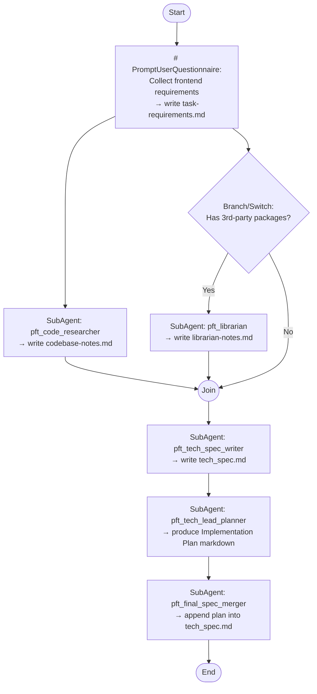

## Workflow Execution Guide

Follow the Mermaid flowchart above. This workflow is optimized for **frontend** work only.
- **UI/UX components and screens**
- **State management and user flows**
- **API integration via repositories (with placeholder TODOs)**
- **No backend implementation**
- **No test-writing tasks**

### Execution Methods by Node Type
- **Rectangle nodes (SubAgent: ...)**: Run the specified sub-agent prompt file from `.claude/agents/`.
- **Prompt nodes**: Execute the prompt text below and write the required output file.
- **Diamond nodes (Branch/Switch: ...)**: Branch automatically based on available inputs (see rules below).
- **Join node**: Continue only after required upstream artifacts exist.

### Branch Rule: Has 3rd-party packages?
Read `task-requirements.md`:
- If it contains one or more third-party UI libraries/services → run `pft_librarian`
- Otherwise skip Librarian and continue

## Prompt Node Details

### prompt_requirements(# PromptUserQuestionnaire...)
Ask the user:
- What feature/UI do you want to build/change?
- New or modification?
- Third-party UI libraries/services? (e.g., component libraries, UI kits)
- Codebase keywords / related modules? (components, screens, features)
- API endpoints needed? (for repository layer)

Then write `task-requirements.md` using the `pft_requirements_intake` agent output format.

### join_research((Join))
Ensure these files exist before proceeding:
- `task-requirements.md`
- `codebase-notes.md`
- (optional) `librarian-notes.md`

## Expected Artifacts (files)
- `task-requirements.md`
- `codebase-notes.md`
- `librarian-notes.md` (optional)
- `tech_spec.md` (final)
